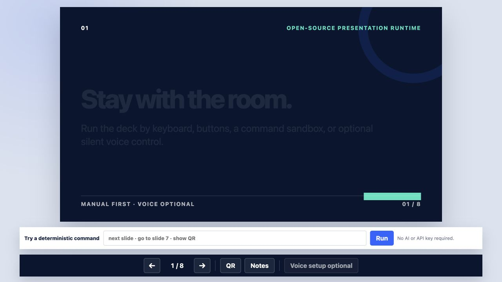

# GPT Realtime Slides

A customizable, manual-first presentation runtime with separate presenter and audience views, speaker notes, QR sharing, deterministic command controls, and optional silent OpenAI Realtime voice navigation.

**[Try the public demo](https://a-makelky.github.io/GPT-Realtime-Slides/)** · [Open the audience-only view](https://a-makelky.github.io/GPT-Realtime-Slides/slides.html)



The hosted demo needs no account, test data, or API key. Use the command sandbox to try `next slide`, `go to slide 7`, `show QR`, or `hide overlay`.

## Why this exists

Presentation software usually assumes the presenter is near a keyboard. GPT Realtime Slides keeps the human with the room while preserving a complete manual fallback.

- One canonical content source renders both presenter and audience views.
- Audience pages never contain the presenter console or speaker notes.
- Keyboard, button, sandbox, and Realtime actions call the same deterministic controller.
- Voice control is wake-word gated, silent, and limited to one allowlisted tool call.
- The deck still works when the microphone, network, or OpenAI integration is unavailable.
- No API key, attendee data, personal contact information, or production account identifier ships with the project.

## Test it without rebuilding

Visit the [hosted presenter demo](https://a-makelky.github.io/GPT-Realtime-Slides/). Then:

1. Use the arrow buttons or keyboard arrows.
2. Enter `go to slide 7` in the command sandbox.
3. Select **QR** and scan the audience link.
4. Open **Notes** and confirm those notes are absent from the audience page.

The public demo intentionally leaves Realtime disabled because an open-source repository and static site must not include or expose a maintainer's API credentials. The full Realtime client is included for deployers who connect their own protected backend.

## Run locally

Requirements: Node.js 20 or newer on macOS, Windows, or Linux, plus a current Chromium, Firefox, or Safari browser.

```bash
npm install
npm run dev
```

Open `http://127.0.0.1:4173/` for the presenter and `http://127.0.0.1:4173/slides.html` for the audience view.

Verification:

```bash
npm run verify
```

## Customize it

The starter keeps the authoring surface deliberately small:

- `src/content/deck.js` owns all sample slide copy and notes.
- `src/config.js` owns theme tokens, QR behavior, the wake word, and optional Realtime settings.
- `src/core/renderer.js` owns the seven safe layouts: `title`, `statement`, `bullets`, `columns`, `steps`, `quote`, and `closing`.
- `src/styles.css` owns the visual system and responsive behavior.

Slides are data, not arbitrary HTML. The schema rejects duplicate IDs, unknown layouts, and raw `html` fields. This keeps customization approachable and prevents slide content from quietly turning into executable code.

## Optional OpenAI Realtime voice control

Realtime is off by default and is not needed for the public demo.

To activate it for your own deployment:

1. Provide `OPENAI_API_KEY` only in your server environment. Never place it in `src/`, a client-side environment variable, or a committed file.
2. Run or adapt `server/realtime-token-server.mjs`. It requests a short-lived client secret from OpenAI and never returns the standard key.
3. Set `config.realtime.enabled` to `true` and point `clientSecretEndpoint` at your protected endpoint.
4. Add real authentication and rate limiting before exposing a credential-minting endpoint publicly.

The sample server binds only to `127.0.0.1` and accepts only the local Vite origins. It is a development reference, not a production credential broker.

This follows OpenAI's current [Realtime WebRTC guidance](https://developers.openai.com/api/docs/guides/realtime-webrtc): standard keys remain server-side, browsers receive ephemeral client secrets, and Realtime connections use WebRTC.

## How Codex and GPT-5.6 shaped the project

This project began as a production presentation system built for a live community event during OpenAI Build Week. Codex helped turn that event-specific implementation into a reusable public tool.

Codex accelerated four parts of the work:

1. **Architecture excavation.** It mapped the working event system and separated the reusable control layer from forms, attendee data, live infrastructure, and personal assets.
2. **Parallel risk review.** Independent subagents audited PII, secrets, licensing, repository history, and the clean extraction boundary.
3. **Product decisions.** The human decision was to keep one content source, manual controls as the foundation, presenter/audience separation, and a narrow silent voice contract. Codex implemented and tested those decisions.
4. **Public-release verification.** Codex created a new history from an allowlist, added privacy regression tests, validated the production build, and tested the hosted presenter and audience routes.

The most consequential decisions were not code generation: exclude the event database entirely, exclude every personal proof asset instead of redacting it, make the public demo useful without credentials, and treat Realtime as an optional controller rather than the presentation engine.

Primary Codex `/feedback` session ID: `019f7cd2-ff5e-7843-9035-22699c0049cc`

## Hackathon work boundary

The live-event ancestor and this public productization were created during the July 13–21, 2026 OpenAI Build Week submission period. This repository contains only the newly extracted, generalized implementation. It deliberately does not import the private event repository's history, attendee systems, personal media, or deployment configuration.

## Privacy and security

- No telemetry, cookies, forms, analytics, accounts, or attendee storage.
- No browser fingerprinting or personal identifiers.
- No standard API key in the browser or repository.
- Speaker notes are presentation-only separation, not a secrets boundary; anything shipped to the browser must be safe to publish.
- The repository test suite scans public source for known event identities, domains, phone-number patterns, and API-key shapes.

Please report security issues through the process in [SECURITY.md](SECURITY.md).

## License and trademarks

Code is available under the [MIT License](LICENSE). The project uses system fonts and contains no third-party photos, logos, music, or screenshots.

OpenAI, GPT, and Codex are trademarks of OpenAI. This independent open-source project is not an official OpenAI product and does not imply endorsement.
